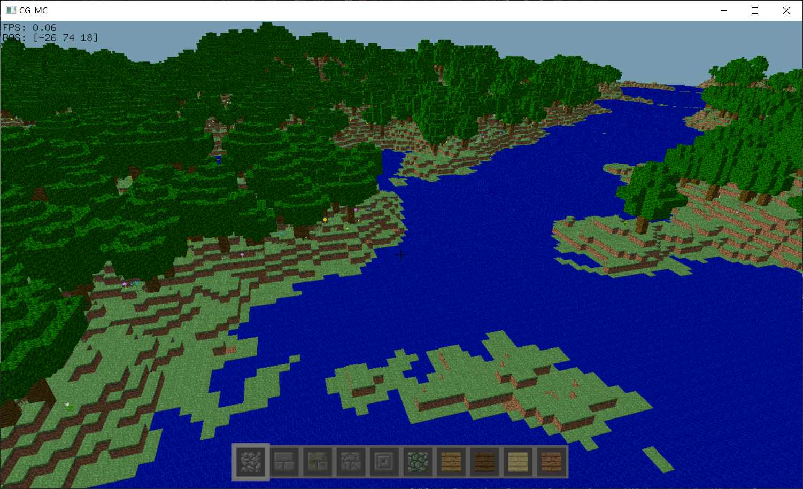
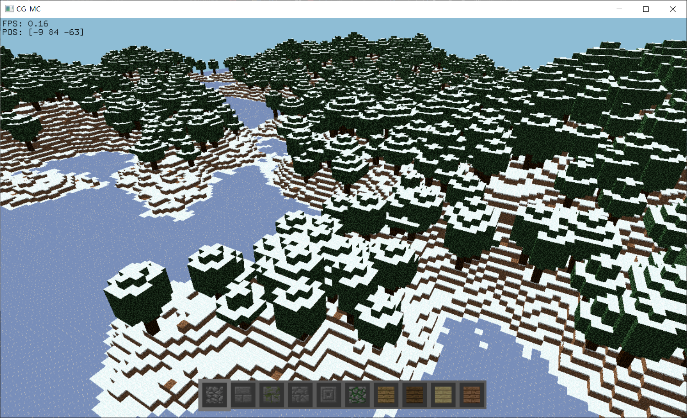
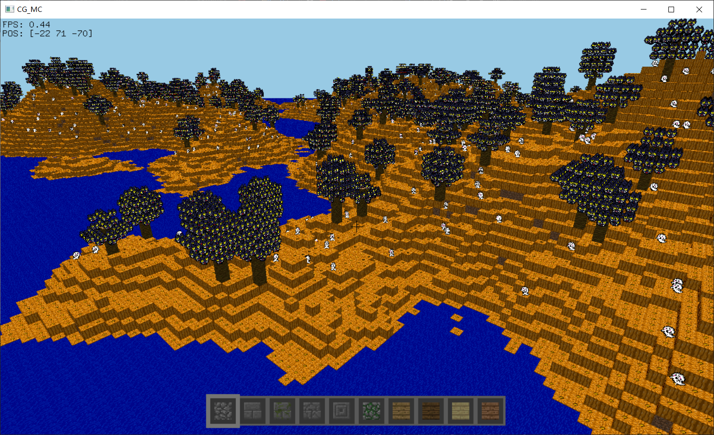

# CG_MC

本项目为GLUT个人实践项目，程序实现了Minecraft游戏简易版本的仿制。

## 开发环境

Visual Studio 2022

项目依赖：

- glut

注：程序运行所需性能较高，若有条件请使用独立显卡进行渲染。

## 操作说明

- 人物移动
  - `WASD` 用于人物的前后左右移动
  - `M` 键可切换飞行/重力模式
  - 飞行模式下，方向键上下可使人物上下移动
  - 空格键用于人物跳跃
- 视角变换
  - 鼠标的移动用于视角控制，程序运行中会捕获鼠标，鼠标不被程序捕获时可单击游戏窗口进入捕获
  - `ESC`： 释放鼠标
- 方块建造/摧毁
  - `e`： 打开/关闭物品列表，开启后点击物品列表中的物品，再点击背包栏可将物品放入背包栏
  - 方向键左右：切换背包栏物品
  - 数字键 ` 0 - 9` ：快捷切换背包栏物品
  - 鼠标左键：短按放置方块，长按摧毁方块

- 游戏配置
  - 在文件 `'./data/seed.txt'` 中可使用32位无符号整数指定世界种子
  - `+` 和 `-` 用于在游戏中调整渲染范围大小
  - **程序不会自动保存更改**，按 `Ctrl + S` 手动保存更改，或在退出时使用 `~` 键退出。

## 运行截图

